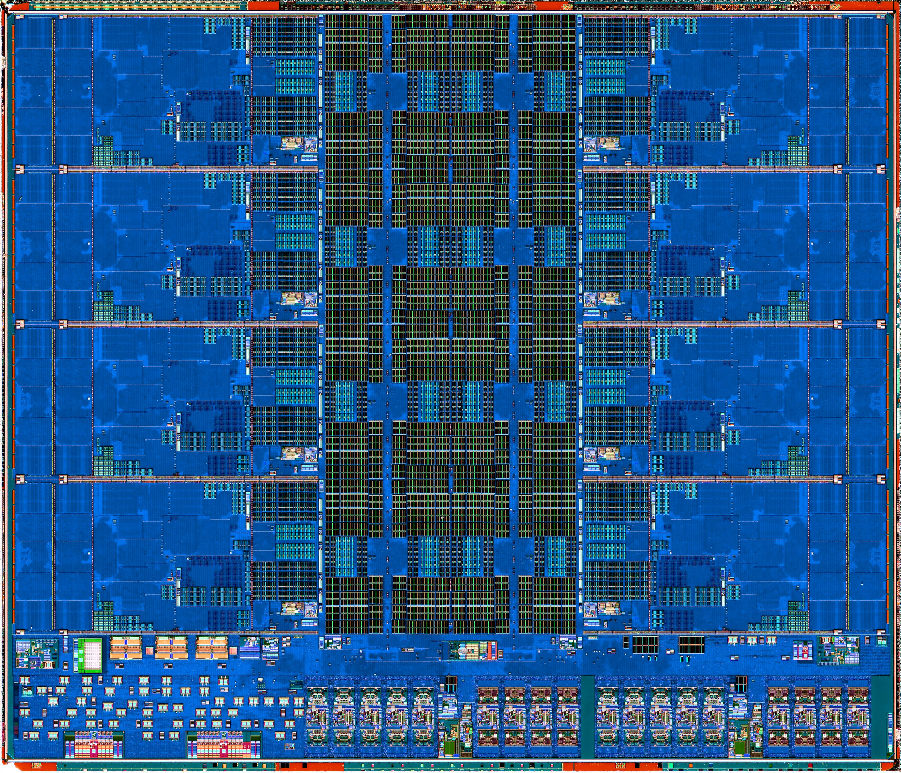

# Salvage — die-shot pan/zoom → Integer Execution highlight

Rescued from `alu/index.html` (the ALU overview page) before that page was
deleted. This is the scroll-triggered **zoom-and-pan of the CCD die shot that
lands on a single core and fades in the purplish "Integer Execution" polygon**.
Reusable as-is on any dark page. Three parts: HTML, CSS, JS (needs GSAP +
ScrollTrigger, already loaded site-wide).

Image asset: `assets/Meet-The-Processor/ccd-dieshot-detail-opt.jpg`
(labeled floorplan the polygon %s were derived from:
`assets/ccd-dieshot-bottom-left-detail.jpg`).

---

## 1. HTML (the `.overview-band` section)

```html
<!-- Full-bleed split band: the die shot fills the entire right half of
     the viewport, with the text sitting on its own dark panel on the left. -->
<section class="overview-band" aria-labelledby="overview-title">
  <div class="overview-band__panel">
    <div class="overview-band__panel-inner">
      <p class="kicker">On the Die</p>
      <h2 id="overview-title">What you're looking at.</h2>
      <p>
        The ALU presented in this project is represented as a single unit.
        Modern processors such as AMD's Ryzen&trade; 5 9600X use a more
        advanced design. Instead of one ALU, each CPU core contains multiple
        execution units, including integer ALUs, address generation units
        (AGUs), branch units, and floating-point/vector units. These
        specialized units allow several operations to be executed in
        parallel, greatly increasing performance compared to a single-ALU
        design.
      </p>
      <p>
        For simplicity, we start with a pared-down version of the integer
        execution that goes on in a processor. The processor does simple
        arithmetic, logic operations, and even a set-less-than operation.
        See how the ALU works below!
      </p>
    </div>
  </div>
  <figure class="overview-band__art">
    <!-- Fixed crop window: stays the same size/position while scroll.js
         scales the image *inside* it (zoom-within-frame). -->
    <div class="overview-band__crop">
      <!-- Image + highlight share one transformed layer so the highlight
           stays locked to the silicon as scroll.js zooms/pans. -->
      <div class="overview-band__zoom">
        
        <!-- Revealed after the zoom lands: the integer-execution block of
             this core (see assets/ccd-dieshot-bottom-left-detail.jpg). -->
        <div class="overview-band__hl">
          <span class="overview-band__hl-text">Integer Execution</span>
        </div>
      </div>
    </div>
  </figure>
</section>
```

---

## 2. CSS (was in `styles/alu.css`) — includes the purplish polygon

```css
.overview-band {
  display: grid;
  grid-template-columns: 1fr 1fr;
  min-height: 100vh;
  /* No border or own background: the page's continuous theme-dark glow shows
     through the left panel so this band reads as part of one unbroken surface
     (the die shot still covers the right half edge-to-edge). */
  background: transparent;
}

/* Left half — text sits directly on the shared band background. */
.overview-band__panel {
  display: flex;
  align-items: center;
  justify-content: center;
  padding: clamp(var(--space-4), 5vw, var(--space-7));
}
.overview-band__panel-inner {
  max-width: 40rem;
}
.overview-band__panel .kicker {
  color: #b794f6;
}
.overview-band__panel h2 {
  color: #fdfdfb;
}
.overview-band__panel p {
  color: rgba(253, 253, 251, 0.74);
  margin-bottom: 0;
}
.overview-band__panel p + p {
  margin-top: 2.5em;
}
.overview-band__panel strong {
  color: #fdfdfb;
  font-weight: 600;
}

/* Right half — the whole image stays visible over the shared band background. */
.overview-band__art {
  margin: 0;
  height: 100%;
  padding-right: clamp(var(--space-3), 4vw, var(--space-6));
  display: flex;
  align-items: center;
  justify-content: flex-start;
}
/* The crop window: matches the die-shot's aspect ratio, sits at a fixed size
   and position, and clips whatever spills past it. The zoom happens *inside*
   this frame, so the window itself never moves or resizes. */
.overview-band__crop {
  position: relative;
  width: 100%;
  aspect-ratio: 7849 / 6737;
  max-width: 100%;
  max-height: 100%;
  overflow: hidden;
  border: 1px solid rgba(255, 255, 255, 0.14);
  border-radius: var(--radius-sm);
}
/* The zoom layer holds the image + highlight so they scale/pan together.
   scroll.js scrubs scale()/x on this element. */
.overview-band__zoom {
  position: absolute;
  inset: 0;
  /* Zoom focal point — column 1, row 3 core. Tweak these two %s to re-aim
     the zoom (x across, y down). */
  transform-origin: 4% 53%;
}
.overview-band__zoom img {
  display: block;
  width: 100%;
  height: 100%;
  object-fit: cover;
}

/* === THE PURPLISH INTEGER-EXECUTION POLYGON ===
   Highlight over the integer-execution block of the zoomed core. Positioned
   as a %-of-image rectangle so it rides along with the zoom. The numbers are
   derived from the labeled floorplan (ccd-dieshot-bottom-left-detail.jpg);
   nudge left/top/width/height to re-aim. Hidden until scroll.js reveals it. */
.overview-band__hl {
  position: absolute;
  left: 12.95%;
  top: 47.45%;
  width: 6.45%;
  height: 5.99%;
  background: rgba(205, 180, 242, 0.45); /* translucent light-purple fill */
  opacity: 0;
  pointer-events: none;
  /* Body = lower rectangle + square bump on the right of its top edge; a skinny
     rectangle hanging below the bottom (left edge out to ~2/3 across); plus a
     box jutting right from the bottom-right corner. Box-local %s. */
  clip-path: polygon(
    0% 39.2%, 44.2% 39.2%, 44.2% 0%, 78.3% 0%,
    78.3% 73.3%, 100% 73.3%, 100% 88.3%, 53% 88.3%,
    53% 100%, 0% 100%
  );
}
/* Label centered in the main rectangle of the highlight. Sized in image-space
   px (tiny) so the zoom magnifies it to a legible size. */
.overview-band__hl-text {
  position: absolute;
  left: 0;
  right: 0;
  top: 63%;
  transform: translate(-5px, -50%);
  text-align: center;
  font-family: var(--font-mono);
  font-weight: 500;
  font-size: 3.2px;
  line-height: 1.1;
  letter-spacing: 0.01em;
  color: #fdfdfb;
  text-shadow: 0 0 1.5px rgba(20, 20, 26, 0.7);
}

@media (max-width: 760px) {
  .overview-band {
    grid-template-columns: 1fr;
    min-height: 0;
  }
  .overview-band__art {
    padding: var(--space-3);
    justify-content: center;
  }
  .overview-band__crop {
    width: 100%;
    height: auto;
  }
}
```

---

## 3. JS (was in `scripts/scroll.js`, inside the GSAP/ScrollTrigger init)

Requires `gsap` + `ScrollTrigger`. Plays once when the section's midpoint hits
the viewport centre, then holds.

```js
/* ---- Overview band: zoom the die shot in toward the column-1 / row-3 core.
       The animation plays on its own (not scrubbed) but only starts once the
       reader is halfway into the section. It zooms in once and stays there.
       The focal point lives in CSS (transform-origin on the img). Durations
       are in seconds — tweak freely. ---- */
var overviewBand = document.querySelector(".overview-band");
if (overviewBand) {
  var zoomLayer = overviewBand.querySelector(".overview-band__zoom");
  var hl = overviewBand.querySelector(".overview-band__hl");
  if (zoomLayer) {
    // Paused until the section's midpoint reaches the viewport centre, then
    // it plays through once and holds.
    var zoomTl = gsap.timeline({
      paused: true,
      scrollTrigger: {
        trigger: overviewBand,
        start: "center center",
        toggleActions: "play none none none"
      }
    });

    // Zoom runs across the whole timeline; the rightward pan eases in later.
    zoomTl
      .fromTo(zoomLayer, { scale: 1 },
              { scale: 2.6, ease: "power1.inOut", duration: 4 }, 0)
      .fromTo(zoomLayer, { xPercent: 0 },
              { xPercent: 5, ease: "power1.inOut", duration: 1.8 }, 2.2);

    // Once the zoom + pan have landed, fade the integer-execution
    // highlight in. (Plain opacity — cheaper than an extra transform.)
    if (hl) {
      zoomTl.fromTo(
        hl,
        { opacity: 0 },
        { opacity: 1, ease: "none", duration: 1 },
        3.2
      );
    }
  }
}
```

---

### Notes for re-use
- The **focal point** is `transform-origin: 4% 53%` on `.overview-band__zoom`;
  change those two %s to aim the zoom at a different core.
- The **polygon** rides inside the same transformed layer, so its `left/top/
  width/height` are %-of-image and it stays locked to the silicon through the
  zoom/pan. Re-aim via those four values; reshape via the `clip-path` points.
- A near-identical move exists on the home page's `.journey__zoom` (die map →
  single Zen 5 core, with a spotlight hole) in `scripts/scroll.js` ~line 875 —
  reference if you want the masked-hole variant instead of a filled polygon.
